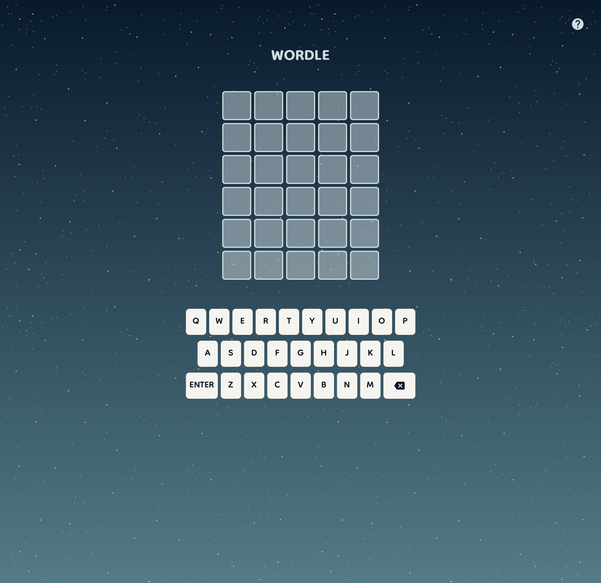
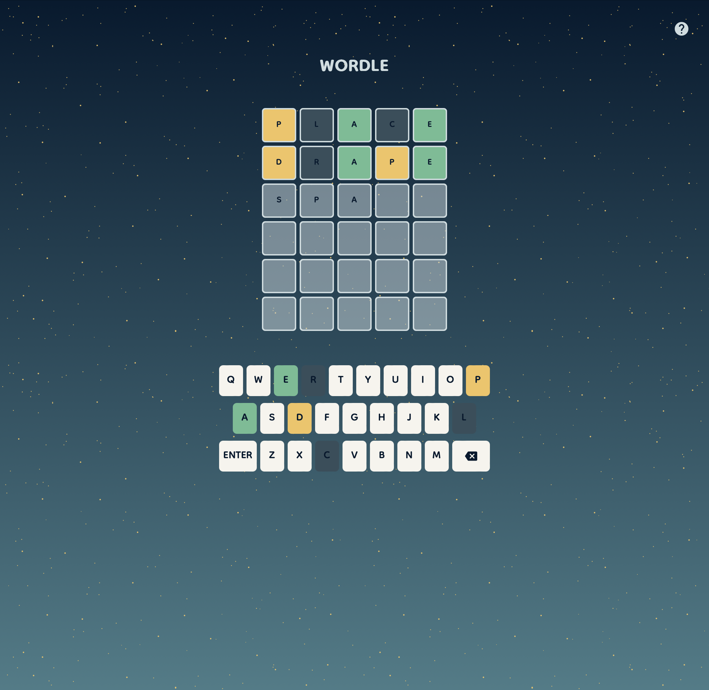
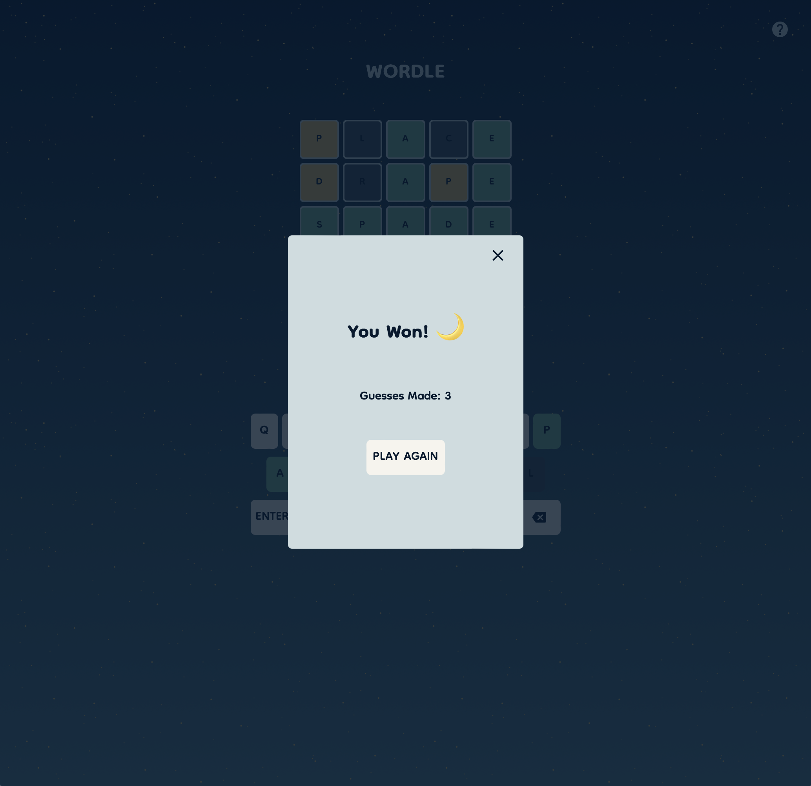
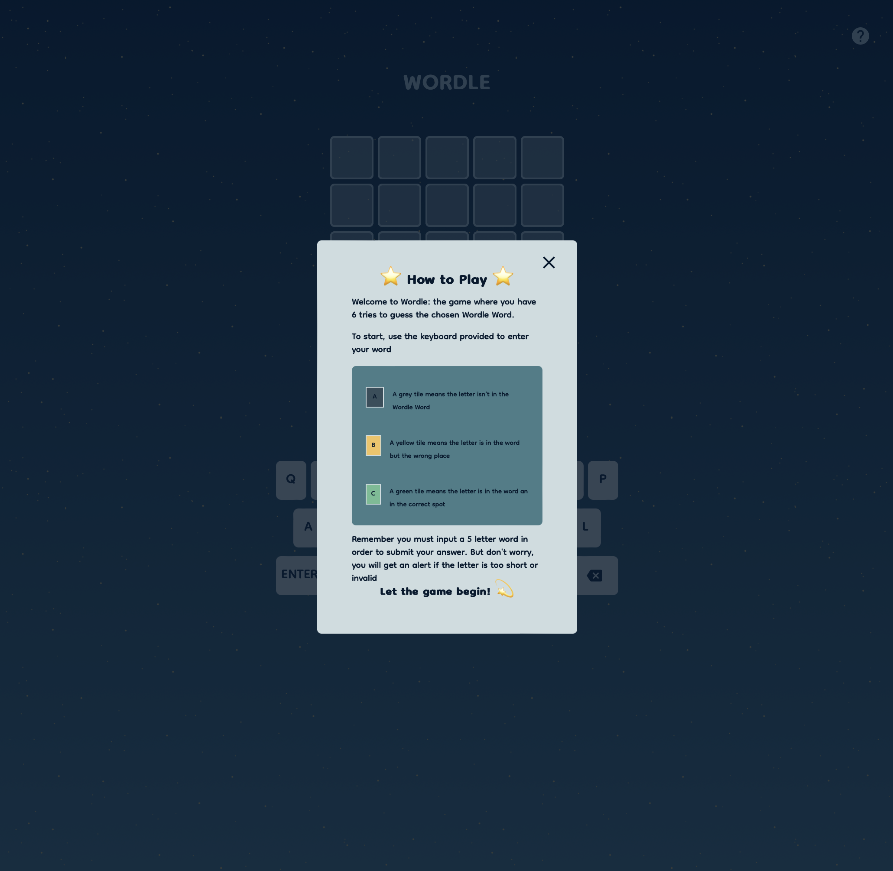

# Wordle
Welcome to Wordle! This project is a clone of the web-based game Wordle created by Josh Wardle, which was originally released in 2021. 

Wordle is a game I have enjoyed playing in the past. It's a good challenge to attempt to strategically decipher the tile colors given to form a new guess. Its exciting to see the tiles filp to reveal whether the guess was correct or not.

[Wordle Project Demo](https://erlopez11.github.io/wordle/)

## Description

**Tech Used:** HTML, CSS, Javascript 

The object of the game is to guess the chosen word in six tries. As each guess is made, the tiles containing the letters flip to reveal whether the letter is correct and in the correct position.

This game logic presented a great opportunuty to apply what I have learned so far about conditionals, loops, functions, and DOM manipulation. This was also my first time creating animations and transitions using CSS and applying them to an element that wasn't related to opening a navigation menu.

## Challenges
This project presented quite a few challenges that needed to be overcome; while the game appears as a simple minimalistic design, there are multiple small functions happening in the background. It was helpful to break the code down into small little pieces instead of trying to code it as one big operation.

The most difficult part of this project ultimately appeared when it came time to render all of the DOM elements. Specifically in rendering each letter in its individual tile, changing the tile color, and applying  the animation to each tile. During these steps I found that I always ended up applying the style changes to the incorrect DOM element. 

While difficult, this provided me with a great opportunity in getting used to accessing groups of DOM elements and only applying the stylistic change to one individual letter tile.

## Next Steps
* Add transitions for when messages and alerts appear
* Provide player statistics on the number of games won, current streak, and the wins for each guess 
* Provide a version of light/dark mode where the user can toggle between night sky (current version) and morning sky
* add additional animations for when word is invalid/short and for when each letter is added to the tile 

## Attributions
[Wordle Word List By Chris Wilcoxson](https://gist.github.com/slushman/34e60d6bc479ac8fc698df8c226e4264)

## Design and Planning

[Planning Materials](https://docs.google.com/document/d/1mLs6CIeiKNC5eX4JwyEttRVNlzfVewnrKMt08Re2yvU/edit?usp=sharing)

Theme inspired by Spiritfairer game design

